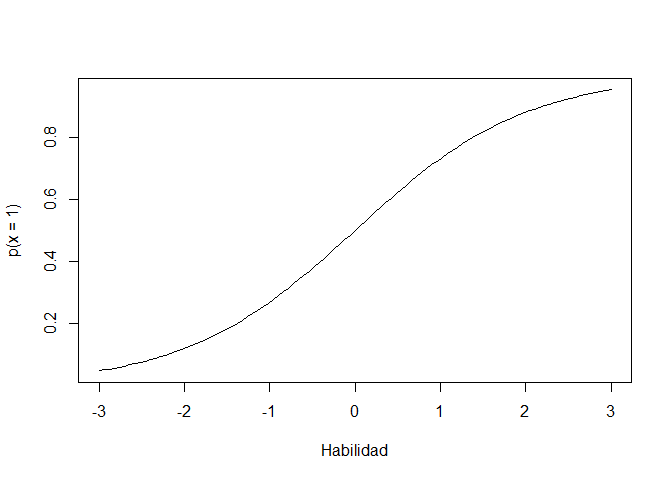
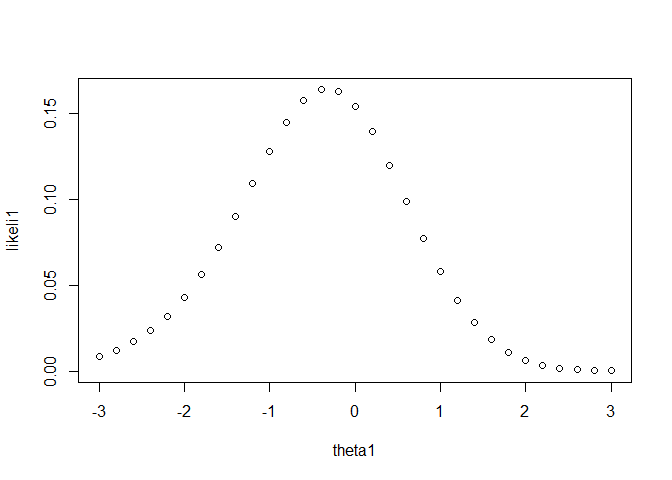
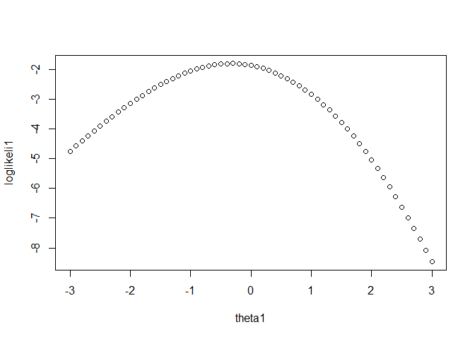
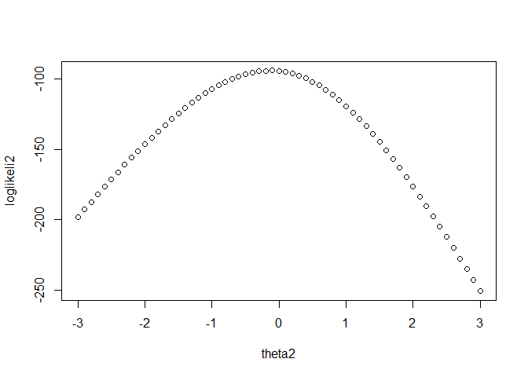
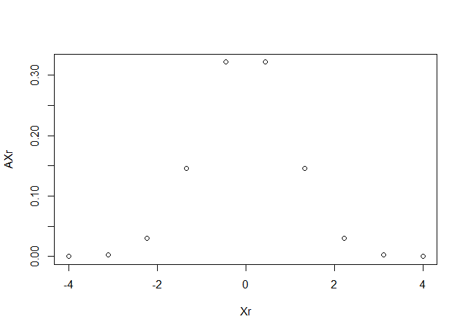
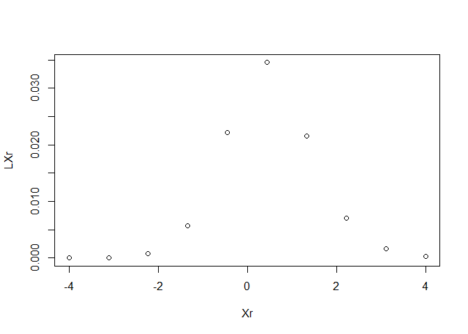

Estimación mediante MMLE
================

El objetivo de este documento es desarrollar una intuición acerca de la
estimación de parámetros en un modelo IRT. La estimación de parámetros
en este caso se hace bajo el método llamado, marginal maximim likelihood
estimation. En base a la literatura, este es el método más común de
estimación, y se basa en la idea de que la muestra de personas que se
utiliza para la estimación de los parámetros de los ítems es
circunstancial (no es el objeto de interés como tal), de modo tal que
utiliza, además de las respuesta de los examinados, información a priori
de la distribución del atributo latente. En general, se asume que este
atributo se distribuye normalmente en la población.

### Recordando el modelo:

$$ p(X\_{ij}=1\|\\theta_i,\\alpha_j,\\delta_j) =\\frac{1}{1+e^{-\\alpha_j(\\theta\_{i} - \\delta_j)}}$$

El modelo dice que la probabilidad de obtener una respuesta correcta es
una función de una serie de parámetros. Respecto a los ítems, estos
pueden estar caracterizados por 1, 2 o 3 parámetros (usualmente 2). En
el caso de las personas, estas están caracterizadas por 1 parámetro, al
cual se le suele llamar habilidad.

``` r
curve(expr = 1/(1+exp(-1*(x-0))), from = -3,to = 3, ylab = "p(x = 1)", xlab="Habilidad")
```

<!-- -->

¿Cómo se estiman los parámetros de los ítems y cómo se estiman los
parámetros de las personas? En el método más común se estiman primero
los parámetros de los ítems y luego los parámetros de las personas. Este
método se llama Marginal Maximum Likelihood.

## Pasos de la estimación:

1.- Estructura de la variable latente: se denite la estructura de la
variable que caracteriza a las personas, en términos de ubicaciones y
pesos (esto es lo que define a una distribución). En general, asumimos
que la habilidad de distribuye normalmente y que va de -3 a 3. Debemos
elegir puntos (nodos) en la distribución y su determinado peso
(frecuencia o probabilidad de ocurrencia).

2.- Parámetros de los ítems. Tenemos que definir valores para los
parámetros de los ítems, los cuales parten de valores a priori que se
van modificando en pasos hasta que se llega un óptimo.

3- Necesitamos datos: la estimación se realiza en base a patrones de
respuesta, los cuales permiten estimar los parámetros óptimos dado un
conjunto de datos.

Proceso de estimación:

### Likelihood:

Necesitamos entender la idea de verosimilitud (y también lo que es la
máxima verosimilitud) a nivel general (método general para la estimación
de parámetros). La verosimilitud (likelihood) no es otra cosa que el
resultado de estimar la probabilidad de ocurrencia de ciertos datos,
dado un un modelo y un determinado valor en los parámetros del mismo.

*p*(*x*\|*θ*,*α*,*δ*)
Por ejemplo, si tenemos un patrón de respuesta (1,1,0,0,0), y tenemos un
vector *δ* = (-1,-.5,0,1,2) que caracteriza la dificultad de los ítems,
y un vector *α* = (1,1,1.5,0.8,2) que caracteriza a la discriminación,
entonces podemos estimar qué tan verosimil es el patrón de respuestas
dado esta información, y adicionalmente, un valor a priori de theta (la
habilidad), podríamos suponer un valor 1.

``` r
likeli = function(x,dis,dif,thet){
  lik_val = c()
  for(i in 1:length(thet)){
  p = (1/(1+exp(-dis*(thet[i]-dif))))
  lik_val[i] = prod(p^x*(1-p)^(1-x))
  }
  return(lik_val)
}
```

``` r
patron1= c(1,1,0,0,0)
dificultad1 = c(-1,-.5,0,1,2)
discriminacion1 = c(1,1,1.5,0.8,2)
theta1 = 1

likeli(x=patron1,dis = discriminacion1, dif = dificultad1, thet = theta1)
```

    ## [1] 0.05785417

Podemos obtener un resultado que resuelve la función de indicamos
anteriormente. Lo interesante es que, podemos iterar esta función
dejando algunos parámetros constantes, para ver cuál es el parámetro más
verosimil que es de nuestro interés. Por ejemplo, podríamos buscar el
valor más verosimil para la habilidad de un evaluado con el patrón
anterior, dado que asumimos que los parámetros de los ítems son valores
conocidos.

``` r
patron1= c(1,1,0,0,0)
dificultad1 = c(-1,-.5,0,1,2)
discriminacion1 = c(1,1,1.5,0.8,2)
theta1 = seq(-3,3,0.2)

likeli1 = likeli(x=patron1,dis = discriminacion1, dif = dificultad1, thet = theta1)

plot(theta1, likeli1)
```

<!-- -->

Obtenemos que podemos ver que hay valores de habilidad más verosímiles
que otros, y que de hecho hay un máximo. Esa es la esencia de la
estimación por máxima verosimilitud, encontrar el valor más verosimil
dado un conjunto de datos y un modelo para uno o más parámetros. Esto
permite que el proceso de estimación sea un proceso de optimización. En
la práctica, la función que se optimiza se basa en la suma del
logaritmo, y no en el producto, de las probabilidades independientemente
estimadas. Esto porque la multiplicación de probabilidades lleva a
valores pequeños que computacionalmente son intratables.

``` r
loglikeli = function(x,dis,dif,thet){
  loglik_val = c()
  for(i in 1:length(thet)){
  p = (1/(1+exp(-dis*(thet[i]-dif))))
  loglik_val[i] = sum(log(p^x*(1-p)^(1-x)))
  }
  return(loglik_val)
}
```

``` r
patron1= c(1,1,0,0,0)
dificultad1 = c(-1,-.5,0,1,2)
discriminacion1 = c(1,1,1.5,0.8,2)
theta1 = seq(-3,3,0.1)

loglikeli1 = loglikeli(x=patron1,dis = discriminacion1, dif = dificultad1, thet = theta1)

plot(theta1, loglikeli1)
```

<!-- -->

El máximo verosimil es el mismo en ambos casos. Sí es posible notar un
hecho importante, que es que la función tiene una forma, la cual puede
ser más o menos chata. Por ejemplo, vemos que si bien hay un máximo,
este punto no es tan sobresaliente respecto a otros puntos próximos.
¿Qué pasa si aumentamos el número de ítems?

``` r
patron2= sample(c(0,1),100,replace = T)
dificultad2 = rnorm(100,0,1)
discriminacion2 = c(runif(100,0.8,2))
theta2 = seq(-3,3,0.1)

loglikeli2 = loglikeli(x=patron2,dis = discriminacion2, dif = dificultad2, thet = theta2)

plot(theta2, loglikeli2)
```

<!-- -->

Hay un pequeño cambio en el la forma de la función, que se traduce en
una mayor certeza respecto a cuál es el valor más verosimil a los datos.

La estimación de los parámetros de los ítems tiene características
similares, pero utiliza otros elementos. Los que se ven a continuación:

## Concepto de Marginal Maximum Likelihood:

Se basa en un modelo bayesiano, de modo que se parte con una idea
respecto a los posibles valores de los parámetros (en este caso de
habilidad), y de los pesos asociados a estos. El Teorema de Byes es:

$$ P(\\theta\|\\textbf{x}) = \\frac{P(\\textbf{x}\|\\theta)P(\\theta )}{P(\\textbf{x})}$$

En este caso, no nos interesa el resultado del Teorema, pero sí algunas
de las características. Principalmente la posibilidad de calcular p(x),
esto es la probabilidad de observar un cierto patrón de respuestas

En concreto, la estimación por marginal maximum likelihood, viene dada
por la posibilidad de calcular la probabilidad marginal del patrón de
respuestas, a partir de la descomposición marginal condicional. Esto es,
la probabilidad marginal de un fenómeno es igual a la suma de las
probabilidades condicionales del mismo, bajo condiciones exhaustivas.

Dos características de la estimación: distribución a priori de la
variable latente (habilidad) y dicretización de la misma. Para este
ejemplo utilizaremos una discretización en 10 puntos de una distribución
normal.

``` r
Xr = seq(-4,4, length.out = 10) ## Xr (valores de teta, de la cuadratura)
AXr = c(.00012, .00281, .03002, .14580, .32130, .32130, .14580, .03002, .00281, .00012) ## Pesos 
bet = c(0,0,0,0,0) # Dificultad
dis = c(1,1,1,1,1) # discriminación
```

En el siguiente gráfico se muestran 10 puntos (nodos), y sus pesos
(alturas) que definen la distribución a priori de la habilidad.

``` r
plot(Xr,AXr)
```

<!-- -->

Esta información la utilizaremos en conjunto con los datos para hacer
una estimación preliminar de los parámetros de los ítems, y generar una
intuición de cómo estos son estimados.

Vamos a suponer que todos los ítems tienen los mismos parámetros al
iniciar la estimación, y supondremos que solo están definidos por la
dificultad y la discriminación.

El elemento base es la probabilidad marginal de un patrón, el cual se
calcula multiplicando la likelihood por el valor del ponderador del
valor del nodo. La sumatoria de esos valores permite el cálculo de la
probabilidad marginal del patrón.

``` r
pat = c(1,0,1,0,1)
b = c(0,0,0,0,0)
a = c(1,1,1,1,1)
Xr = seq(-4,4, length.out = 10) ## Xr (valores de teta, de la cuadratura)
AXr = c(.00012, .00281, .03002, .14580, .32130, .32130, .14580, .03002, .00281, .00012) ## Pesos 

### Paso 1: Calcular L(Xr) para un patrón en un nodo:

LXr = c()

for(i in 1:10){
pj = exp(a*(Xr[i] - b))/(1 + exp(a*(Xr[i]-b))) ## Probabilidad de respuesta correcta o incorrecta de cada ítem. 
LXr[i] = prod((pj^pat)*(1-pj)^(1-pat)) # multiplicamos las probabilidades individuales de respuesta (cada ítem) y guardamos el valor. Luego cambiamos theta
}

plot(Xr,LXr) ## Estos son los likelihoods, condicional a Xr (aunque técnicamente es lo mismo que theta)
```

<!-- -->

``` r
LXr ## Primer elemento listo. Likelihoods del patrón condicional a theta (Xr) y parámetros
```

    ##  [1] 5.611179e-06 7.111082e-05 7.608228e-04 5.685634e-03 2.213906e-02
    ##  [6] 3.452859e-02 2.156941e-02 7.020731e-03 1.596151e-03 3.063600e-04

``` r
PL = LXr*AXr ## Este elemento es nuevo. El likelihood de cada Xr multiplicado por AXr. Estamos calculando la probabilidad marginal del patrón. 

PL ## Esto vendría a ser algo así como el likelihood ponderando por un peso a priori. La suma de esto (recordemos la integral) da la probabilidad marginal del patrón
```

    ##  [1] 6.733415e-10 1.998214e-07 2.283990e-05 8.289654e-04 7.113279e-03
    ##  [6] 1.109404e-02 3.144820e-03 2.107624e-04 4.485186e-06 3.676320e-08

``` r
PL_suma = sum(PL) ## Al sumar, estoy reuniendo toda la información. Teníamos distintos thetas, ahora es una sola cosa. 
PL_suma ## Esto es la probabilidad marginal para un patrón que sería (1,0,1,0,1). ¿Qué pasaría con otro patrón?
```

    ## [1] 0.02241942

Cuando tenemos datos empíricos, tenemos un conjunto de patrones. Lo
importante es saber cuántas veces se repite un patrón. Esto lo podemos
averiguar fácilmente

``` r
set.seed(1234)
items1 = simdata(a = matrix(c(1,1.3,1.3,0.8,1.5)), d=matrix(c(2,1,0,-1,-2)), N=500, itemtype = "2PL")
```

``` r
patron = data.frame(items1) %>% unite(col="patron",sep = "") %>% pull()
items1 = data.frame(cbind(items1,patron))
resumen = items1 %>% count(patron)
items1 = items1 %>% left_join(resumen)
```

    ## Joining, by = "patron"

``` r
items1 = unique(items1)
```

``` r
head(items1)
```

    ##   Item_1 Item_2 Item_3 Item_4 Item_5 patron  n
    ## 1      1      0      0      1      0  10010 15
    ## 2      1      1      0      0      0  11000 72
    ## 3      1      1      1      0      0  11100 86
    ## 4      0      0      0      0      0  00000 27
    ## 8      0      1      0      0      0  01000 17
    ## 9      1      0      1      0      0  10100 26

Lo que tenemos que hacer es:

1.- Calcular la likelihood para cada patrón para cada nodo.

2.- Calcular la probabilidad marginal de cada patrón (sumatoria de la
likelihood ponderada por el peso del nodo).

3.- Calcular la probabilidad posterior *p*(*θ*\|*x*)

Paso 1:

``` r
b = c(0,0,0,0,0)
a = c(1,1,1,1,1)
items1 = items1 %>% mutate(across(.cols = 1:5, .fns = function(x){as.numeric(x)}))
lik_matriz = c()
for(i in 1:nrow(items1)){
  liks = likeli(x=items1[i,1:5],dif = b, dis = a,thet = Xr)
  lik_matriz = rbind(lik_matriz,liks)
}
```

Paso 2:

``` r
colnames(lik_matriz) = paste("Xr",round(Xr,2), sep = "_")
lik_data = data.frame(lik_matriz) ## Base de datos con toda la información (LXr) para cada valor theta
lik_data
```

    ##                Xr_.4     Xr_.3.11     Xr_.2.22     Xr_.1.33    Xr_.0.44
    ## liks    3.063600e-04 1.596151e-03 7.020731e-03 0.0215694074 0.034528592
    ## liks.1  3.063600e-04 1.596151e-03 7.020731e-03 0.0215694074 0.034528592
    ## liks.2  5.611179e-06 7.111082e-05 7.608228e-04 0.0056856341 0.022139056
    ## liks.3  9.132463e-01 8.041756e-01 5.978332e-01 0.3104251016 0.083988226
    ## liks.4  1.672669e-02 3.582717e-02 6.478601e-02 0.0818271684 0.053851603
    ## liks.5  3.063600e-04 1.596151e-03 7.020731e-03 0.0215694074 0.034528592
    ## liks.6  1.672669e-02 3.582717e-02 6.478601e-02 0.0818271684 0.053851603
    ## liks.7  5.611179e-06 7.111082e-05 7.608228e-04 0.0056856341 0.022139056
    ## liks.8  1.672669e-02 3.582717e-02 6.478601e-02 0.0818271684 0.053851603
    ## liks.9  1.882341e-09 1.411429e-07 8.934820e-06 0.0003950575 0.009101638
    ## liks.10 1.027723e-07 3.168089e-06 8.244886e-05 0.0014987169 0.014195128
    ## liks.11 3.063600e-04 1.596151e-03 7.020731e-03 0.0215694074 0.034528592
    ## liks.12 1.027723e-07 3.168089e-06 8.244886e-05 0.0014987169 0.014195128
    ## liks.13 1.672669e-02 3.582717e-02 6.478601e-02 0.0818271684 0.053851603
    ## liks.14 3.063600e-04 1.596151e-03 7.020731e-03 0.0215694074 0.034528592
    ## liks.15 1.672669e-02 3.582717e-02 6.478601e-02 0.0818271684 0.053851603
    ## liks.16 5.611179e-06 7.111082e-05 7.608228e-04 0.0056856341 0.022139056
    ## liks.17 1.027723e-07 3.168089e-06 8.244886e-05 0.0014987169 0.014195128
    ## liks.18 1.027723e-07 3.168089e-06 8.244886e-05 0.0014987169 0.014195128
    ## liks.19 5.611179e-06 7.111082e-05 7.608228e-04 0.0056856341 0.022139056
    ## liks.20 5.611179e-06 7.111082e-05 7.608228e-04 0.0056856341 0.022139056
    ## liks.21 3.063600e-04 1.596151e-03 7.020731e-03 0.0215694074 0.034528592
    ## liks.22 3.063600e-04 1.596151e-03 7.020731e-03 0.0215694074 0.034528592
    ## liks.23 3.063600e-04 1.596151e-03 7.020731e-03 0.0215694074 0.034528592
    ## liks.24 5.611179e-06 7.111082e-05 7.608228e-04 0.0056856341 0.022139056
    ## liks.25 5.611179e-06 7.111082e-05 7.608228e-04 0.0056856341 0.022139056
    ## liks.26 1.027723e-07 3.168089e-06 8.244886e-05 0.0014987169 0.014195128
    ##             Xr_0.44      Xr_1.33      Xr_2.22      Xr_3.11         Xr_4
    ## liks    0.022139056 0.0056856341 7.608228e-04 7.111082e-05 5.611179e-06
    ## liks.1  0.022139056 0.0056856341 7.608228e-04 7.111082e-05 5.611179e-06
    ## liks.2  0.034528592 0.0215694074 7.020731e-03 1.596151e-03 3.063600e-04
    ## liks.3  0.009101638 0.0003950575 8.934820e-06 1.411429e-07 1.882341e-09
    ## liks.4  0.014195128 0.0014987169 8.244886e-05 3.168089e-06 1.027723e-07
    ## liks.5  0.022139056 0.0056856341 7.608228e-04 7.111082e-05 5.611179e-06
    ## liks.6  0.014195128 0.0014987169 8.244886e-05 3.168089e-06 1.027723e-07
    ## liks.7  0.034528592 0.0215694074 7.020731e-03 1.596151e-03 3.063600e-04
    ## liks.8  0.014195128 0.0014987169 8.244886e-05 3.168089e-06 1.027723e-07
    ## liks.9  0.083988226 0.3104251016 5.978332e-01 8.041756e-01 9.132463e-01
    ## liks.10 0.053851603 0.0818271684 6.478601e-02 3.582717e-02 1.672669e-02
    ## liks.11 0.022139056 0.0056856341 7.608228e-04 7.111082e-05 5.611179e-06
    ## liks.12 0.053851603 0.0818271684 6.478601e-02 3.582717e-02 1.672669e-02
    ## liks.13 0.014195128 0.0014987169 8.244886e-05 3.168089e-06 1.027723e-07
    ## liks.14 0.022139056 0.0056856341 7.608228e-04 7.111082e-05 5.611179e-06
    ## liks.15 0.014195128 0.0014987169 8.244886e-05 3.168089e-06 1.027723e-07
    ## liks.16 0.034528592 0.0215694074 7.020731e-03 1.596151e-03 3.063600e-04
    ## liks.17 0.053851603 0.0818271684 6.478601e-02 3.582717e-02 1.672669e-02
    ## liks.18 0.053851603 0.0818271684 6.478601e-02 3.582717e-02 1.672669e-02
    ## liks.19 0.034528592 0.0215694074 7.020731e-03 1.596151e-03 3.063600e-04
    ## liks.20 0.034528592 0.0215694074 7.020731e-03 1.596151e-03 3.063600e-04
    ## liks.21 0.022139056 0.0056856341 7.608228e-04 7.111082e-05 5.611179e-06
    ## liks.22 0.022139056 0.0056856341 7.608228e-04 7.111082e-05 5.611179e-06
    ## liks.23 0.022139056 0.0056856341 7.608228e-04 7.111082e-05 5.611179e-06
    ## liks.24 0.034528592 0.0215694074 7.020731e-03 1.596151e-03 3.063600e-04
    ## liks.25 0.034528592 0.0215694074 7.020731e-03 1.596151e-03 3.063600e-04
    ## liks.26 0.053851603 0.0818271684 6.478601e-02 3.582717e-02 1.672669e-02

``` r
marg_prob = lik_matriz %*% AXr ## calculamos las probabilidades marginales de cada patrón 
marg_prob ## Ahora se guarda para cada patrón un PL que sería algo así como un resumen de un montón de cosas sum(likelihood*AXr), moviéndonos en Xr (theta) para cada patrón (probabilidad marginal)
```

    ##            [,1]
    ## liks 0.02241942
    ## liks 0.02241942
    ## liks 0.02241942
    ## liks 0.09554390
    ## liks 0.03606237
    ## liks 0.02241942
    ## liks 0.03606237
    ## liks 0.02241942
    ## liks 0.03606237
    ## liks 0.09554390
    ## liks 0.03606237
    ## liks 0.02241942
    ## liks 0.03606237
    ## liks 0.03606237
    ## liks 0.02241942
    ## liks 0.03606237
    ## liks 0.02241942
    ## liks 0.03606237
    ## liks 0.03606237
    ## liks 0.02241942
    ## liks 0.02241942
    ## liks 0.02241942
    ## liks 0.02241942
    ## liks 0.02241942
    ## liks 0.02241942
    ## liks 0.02241942
    ## liks 0.03606237

Paso 3: la probabilidad posterior, de un valor específico de theta
(definido a priori) dado un patrón (fijo), y un peso del nodo (AXr) es:

``` r
lik_matriz[1,5] ## valor puntual de la likelihood
```

    ## [1] 0.03452859

``` r
Xr[5] ## valor del nodo
```

    ## [1] -0.4444444

``` r
AXr[5] ## valor del peso a priori
```

    ## [1] 0.3213

``` r
marg_prob[5] # probabilidad marginal del patrón
```

    ## [1] 0.03606237

``` r
items1[5,6] # patrón
```

    ## [1] "01000"

``` r
lik_matriz[1,5]*AXr[5]/marg_prob[5]
```

    ## [1] 0.3076347

Para cada nodo podemos calcular todas las probabilidades condicionales
variando los patrones observados.

``` r
lik_matriz[,5]*AXr[5]/marg_prob
```

    ##            [,1]
    ## liks 0.49484037
    ## liks 0.49484037
    ## liks 0.31728194
    ## liks 0.28243998
    ## liks 0.47979431
    ## liks 0.49484037
    ## liks 0.47979431
    ## liks 0.31728194
    ## liks 0.47979431
    ## liks 0.03060746
    ## liks 0.12647241
    ## liks 0.49484037
    ## liks 0.12647241
    ## liks 0.47979431
    ## liks 0.49484037
    ## liks 0.47979431
    ## liks 0.31728194
    ## liks 0.12647241
    ## liks 0.12647241
    ## liks 0.31728194
    ## liks 0.31728194
    ## liks 0.49484037
    ## liks 0.49484037
    ## liks 0.49484037
    ## liks 0.31728194
    ## liks 0.31728194
    ## liks 0.12647241

Estas son probabilidades posteriores. Lo que podemos hacer ahora es
ponderar el número de casos que obtuvo un determinado patrón por este
valor y sumarlos, y hacer esto para cada nodo. En contreto, esto es una
suma ponderada (el ponderador es la probabilidad posterior):

``` r
lik_matriz[,5]*AXr[5]*items1$n/marg_prob
```

    ##            [,1]
    ## liks  7.4226056
    ## liks 35.6285067
    ## liks 27.2862469
    ## liks  7.6258796
    ## liks  8.1565032
    ## liks 12.8658496
    ## liks  1.9191772
    ## liks  3.8073833
    ## liks 27.3482756
    ## liks  1.1630836
    ## liks  5.3118411
    ## liks  1.9793615
    ## liks  4.6794790
    ## liks  0.9595886
    ## liks  2.9690422
    ## liks  2.3989715
    ## liks  5.3937930
    ## liks  0.3794172
    ## liks  0.8853068
    ## liks  1.5864097
    ## liks  0.6345639
    ## liks  0.4948404
    ## liks  3.9587230
    ## liks  0.9896807
    ## liks  0.9518458
    ## liks  0.3172819
    ## liks  0.1264724

Estos valores indican cuanta gente se espera que tenga un valor de
habilidad, dada la probabilidad posterior del valor específico de
habilidad. La suma indica cuanta gente de la muestra se espera que tenga
un cierto valor de habilidad.

``` r
sum(lik_matriz[,5]*AXr[5]*items1$n/marg_prob)
```

    ## [1] 167.2401

En este caso 167 personas se espera que tengan el valor 167. Ahora,
podemos calcular esto para todos los nodos.

``` r
nrj = c()
for(i in 1:10){
nrj[i] = sum(lik_matriz[,i]*AXr[i]*items1$n/marg_prob)
}
nrj
```

    ##  [1]   0.03592378   0.90382931  11.05016779  64.93401670 167.24013016
    ##  [6] 170.35642996  70.93564512  13.31862984   1.17642107   0.04880628

Hay valores de Xr que en sí son poco probables (probabilidad posterior)
y suponemos por tanto que son pocas las personas de la muestra que se
ubican en esa determinada posición.

Podemos, ahora, hacer otro cálculo, que es estimar la cantidad esperada
de personas que tengan correctamente respondido un determinado ítem, al
solo sumar los casos de personas que tienen el ítem contestado de forma
correcta. Veamos el caso del ítem 1:

``` r
items1$Item_1
```

    ##  [1] 1 1 1 0 0 1 0 1 1 1 1 1 1 0 0 0 1 1 1 0 0 0 0 0 1 1 0

La cantidad de personas que se espera que tengan correctamente
respondido el ítem 1 para cada nodo es:

``` r
crj = c()
for(i in 1:10){
crj[i] = sum(items1$Item_1*lik_matriz[,i]*AXr[i]*items1$n/marg_prob)
}
```

``` r
options(scipen = 999)
cbind(Xr,crj,nrj)
```

    ##               Xr           crj          nrj
    ##  [1,] -4.0000000   0.003368035   0.03592378
    ##  [2,] -3.1111111   0.183614902   0.90382931
    ##  [3,] -2.2222222   4.301411147  11.05016779
    ##  [4,] -1.3333333  40.231216175  64.93401670
    ##  [5,] -0.4444444 135.420277673 167.24013016
    ##  [6,]  0.4444444 156.651331184 170.35642996
    ##  [7,]  1.3333333  68.808395441  70.93564512
    ##  [8,]  2.2222222  13.179576381  13.31862984
    ##  [9,]  3.1111111   1.172070445   1.17642107
    ## [10,]  4.0000000   0.048738619   0.04880628

Hay un hecho interesante, que es que la cantidad de casos esperado que
tenga un ítem correcto crj, tiende a nrj en la medida en que Xr es más
alto, ¿por qué pasa esto? Hay que centrarse en aquello en lo cual
difiere la estimación del número de personas que se espera tengan un
determinado ítem correcto. No difieren en los ponderadores (son
simétricos), y levemente en el posterior.

``` r
cbind(items1$Item_1,lik_matriz[,2],lik_matriz[,9],items1$patron)
```

    ##      [,1] [,2]                      [,3]                      [,4]   
    ## liks "1"  "0.00159615143142805"     "0.0000711108227723034"   "10010"
    ## liks "1"  "0.00159615143142805"     "0.0000711108227723034"   "11000"
    ## liks "1"  "0.0000711108227723032"   "0.00159615143142805"     "11100"
    ## liks "0"  "0.804175556015109"       "0.000000141142864526345" "00000"
    ## liks "0"  "0.0358271679714286"      "0.00000316808857592526"  "01000"
    ## liks "1"  "0.00159615143142805"     "0.0000711108227723034"   "10100"
    ## liks "0"  "0.0358271679714286"      "0.00000316808857592526"  "00100"
    ## liks "1"  "0.0000711108227723032"   "0.00159615143142805"     "10110"
    ## liks "1"  "0.0358271679714286"      "0.00000316808857592526"  "10000"
    ## liks "1"  "0.000000141142864526344" "0.804175556015109"       "11111"
    ## liks "1"  "0.00000316808857592524"  "0.0358271679714287"      "11110"
    ## liks "1"  "0.00159615143142805"     "0.0000711108227723034"   "10001"
    ## liks "1"  "0.00000316808857592524"  "0.0358271679714287"      "11101"
    ## liks "0"  "0.0358271679714286"      "0.00000316808857592526"  "00001"
    ## liks "0"  "0.00159615143142805"     "0.0000711108227723034"   "01010"
    ## liks "0"  "0.0358271679714286"      "0.00000316808857592526"  "00010"
    ## liks "1"  "0.0000711108227723032"   "0.00159615143142805"     "11010"
    ## liks "1"  "0.00000316808857592524"  "0.0358271679714287"      "10111"
    ## liks "1"  "0.00000316808857592524"  "0.0358271679714287"      "11011"
    ## liks "0"  "0.0000711108227723032"   "0.00159615143142805"     "01110"
    ## liks "0"  "0.0000711108227723032"   "0.00159615143142805"     "01101"
    ## liks "0"  "0.00159615143142805"     "0.0000711108227723034"   "00101"
    ## liks "0"  "0.00159615143142805"     "0.0000711108227723034"   "01100"
    ## liks "0"  "0.00159615143142805"     "0.0000711108227723034"   "00110"
    ## liks "1"  "0.0000711108227723032"   "0.00159615143142805"     "11001"
    ## liks "1"  "0.0000711108227723032"   "0.00159615143142805"     "10101"
    ## liks "0"  "0.00000316808857592524"  "0.0358271679714287"      "01111"

``` r
pj_it1 = (1/(1+exp(-a[1]*(Xr-b[1]))))
-sum(crj - nrj*pj_it1)
```

    ## [1] -166.8672
